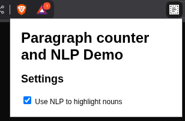
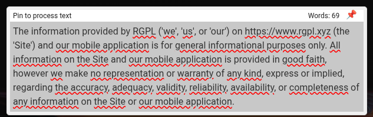

# Paragraph Processor Chrome Extension with NLP API Integration

This project is a Chrome extension that processes text from paragraphs on web pages using Natural Language Processing (NLP). It extracts noun phrases from the text and highlights them dynamically using a shadow DOM. The extension provides a user-friendly interface for text analysis and processing, with optional backend API integration for enhanced NLP capabilities.

## Features

- **Paragraph Counter**: Automatically counts words in selected text and displays the count in the extension popup
- **NLP Text Processing**: Uses Natural Language Processing to identify and highlight noun phrases in text
- **NLP API Integration**: Communicates with an NLP API to fetch noun phrases for highlighting
- **Pin to Process**: Allows users to pin specific text for processing with real-time word counting
- **Dynamic Highlighting**: Automatically attaches shadow DOM to paragraphs and highlights extracted noun phrases with red wavy underlines
- **Custom User Settings**: Provides users with a toggle to enable or disable NLP processing
- **Persistent Storage**: Saves user preferences using Chrome's `chrome.storage.sync`
- **Clean User Interface**: Simple, intuitive popup with settings and processing controls

## Prerequisites

Before you begin, ensure you have the following installed:

- **Node.js** (version 22.18.0 as specified in `.nvmrc`) - [Download here](https://nodejs.org/)
- **nvm** (Node Version Manager) - [Installation guide](https://github.com/nvm-sh/nvm#installing-and-updating)
- **npm** (comes with Node.js) or **yarn**
- **Google Chrome** browser
- **Git** for cloning repositories

You can verify your installations by running:
```bash
node --version
npm --version
git --version
nvm --version
```

## Development Setup

### 1. Clone the Repository

```bash
git clone https://github.com/rgpl-xyz/paragraph-processor-chrome.git
cd paragraph-processor-chrome
```

### 2. Install Dependencies

If you're using nvm (Node Version Manager), the project includes a `.nvmrc` file that specifies the required Node.js version:

```bash
# Install and use the correct Node.js version
nvm install
nvm use

# Install dependencies
npm install
```

If you're not using nvm, make sure you have Node.js version 22.18.0 or compatible installed, then run:

```bash
npm install
```

This will install all the required dependencies including:
- TypeScript for type checking
- Webpack for bundling
- Chrome types for development
- Copy webpack plugin for asset management

### 3. Environment Configuration (Optional)

The extension supports environment variables for configuration. This is useful for different environments (development, staging, production).

#### Setup Environment Variables:

1. **Copy the example file**:
   ```bash
   cp .env.example .env
   ```

2. **Edit the `.env` file** with your configuration:
   ```bash
   # API Configuration
   API_BASE_URL=http://localhost:8080
   API_ENDPOINT=/noun_phrases
   API_TIMEOUT=10000
   API_RETRY_ATTEMPTS=3
   API_RETRY_DELAY=1000

   # Cache Configuration
   CACHE_DURATION=300000
   MAX_CACHE_SIZE=1000

   # Development Configuration
   NODE_ENV=development
   ```

3. **Environment Variables Reference**:
   - `API_BASE_URL`: Base URL for the NLP API (default: `http://localhost:8080`)
   - `API_ENDPOINT`: API endpoint for noun phrase extraction (default: `/noun_phrases`)
   - `API_TIMEOUT`: Request timeout in milliseconds (default: `10000`)
   - `API_RETRY_ATTEMPTS`: Number of retry attempts for failed requests (default: `3`)
   - `API_RETRY_DELAY`: Delay between retries in milliseconds (default: `1000`)
   - `CACHE_DURATION`: Cache entry lifetime in milliseconds (default: `300000` = 5 minutes)
   - `MAX_CACHE_SIZE`: Maximum number of cached entries (default: `1000`)
   - `NODE_ENV`: Environment mode (default: `development`)

**Note**: The `.env` file is ignored by git to prevent committing sensitive data. Make sure to create your own `.env` file based on `.env.example`.

### 4. Build the Extension

#### For Production Build:
```bash
npm run build
```

#### For Development Build:
```bash
npm run build:dev
```

#### For Development (with watch mode):
```bash
npm run dev
```

### 4. Build Output

After building, you'll find the compiled extension in the `./dist` folder with the following structure:

```
dist/
├── manifest.json
├── popup.html
├── popup.js
├── content.js
├── background.js
└── images/
    ├── icon-16.png
    ├── icon-32.png
    ├── icon-48.png
    └── icon-128.png
```

## How to Use the Extension

### User Interface

The extension provides a clean, intuitive interface with the following features:

1. **Main Popup**: 
   - Title: "Paragraph counter and NLP Demo"
   - Settings section with toggle controls
   - Word count display for processed text

2. **Settings Panel**:
   - **"Use NLP to highlight nouns"** checkbox: Enables/disables Natural Language Processing for noun phrase detection
   - When enabled, the extension will highlight noun phrases with red wavy underlines

3. **Text Processing**:
   - **"Pin to process text"** feature: Allows you to select and pin specific text for processing
   - Real-time word counting: Shows the number of words in the selected text (e.g., "Words: 69")
   - Visual feedback: Processed text shows highlighted noun phrases and entities

### Using the Extension

1. **Install and Load**: Follow the installation instructions below
2. **Navigate to a Webpage**: Go to any webpage with text content
3. **Open the Extension**: Click the extension icon in your Chrome toolbar
4. **Enable NLP Processing**: Check the "Use NLP to highlight nouns" option
5. **Process Text**: 
   - Select text on the webpage to see word count
   - Use the "Pin to process text" feature for focused analysis
   - Observe highlighted noun phrases with red wavy underlines
6. **Customize Settings**: Toggle NLP processing on/off as needed

## Chrome Extension Installation

### Method 1: Load Unpacked Extension (Recommended for Development)

1. **Open Chrome Extensions Page**:
   - Open Google Chrome
   - Navigate to `chrome://extensions/` in the address bar
   - Or go to Chrome Menu → More Tools → Extensions

2. **Enable Developer Mode**:
   - Toggle the "Developer mode" switch in the top-right corner
   - This will reveal additional options for loading extensions

3. **Load the Extension**:
   - Click the "Load unpacked" button
   - Navigate to your project directory and select the `./dist` folder
   - Click "Select Folder"

4. **Verify Installation**:
   - The extension should now appear in your extensions list
   - You should see the extension icon in your Chrome toolbar
   - The extension will be listed as "paragraph.counter" (based on package.json name)

### Method 2: Load Extension from Source (Alternative)

If you prefer to load directly from the source directory:

1. Follow steps 1-2 from Method 1
2. Click "Load unpacked" and select the root project folder (not `./dist`)
3. Note: This method requires the source files to be properly structured

### Visual Features

The extension provides several visual indicators to enhance text analysis:

- **Red Wavy Underlines**: Noun phrases and entities are highlighted with red wavy underlines, similar to spell-check indicators
- **Word Count Display**: Real-time word counting shows in the popup (e.g., "Words: 69")
- **Pin Icon**: Red pushpin icon indicates pinned text for processing
- **Clean Interface**: Minimalist popup design with clear settings and controls

### Screenshots

#### Extension Popup Interface


*The main extension popup showing the "Paragraph counter and NLP Demo" interface with settings toggle and clean design.*

#### Text Processing Example


*Example of the extension processing text with highlighted noun phrases (red wavy underlines) and word count display.*

### Example Usage

1. **Text Selection**: Select any text on a webpage to see the word count update in the extension popup
2. **NLP Processing**: With NLP enabled, noun phrases like "RGPL", "Site", "mobile application", "information", etc. will be highlighted
3. **Legal/Technical Documents**: Particularly useful for analyzing legal disclaimers, technical documentation, or any text with complex noun structures
4. **Educational Content**: Helps identify key concepts and entities in educational materials

### Troubleshooting Installation

**Extension not appearing**: 
- Make sure you selected the correct folder (`./dist` for built version)
- Check that the `manifest.json` file is in the selected folder
- Verify that Developer mode is enabled

**Extension shows errors**:
- Check the browser console for error messages
- Ensure all files were built correctly in the `./dist` folder
- Verify that the manifest.json is valid

**Extension icon not visible**:
- Click the puzzle piece icon in the toolbar to see all extensions
- Pin the extension to the toolbar for easy access

## Backend Setup (Optional)

The extension can work with an optional NLP backend API. To set it up:

### 1. Clone the Backend Repository

```bash
git clone https://github.com/rgpl-xyz/nlp-spacy-api.git
cd nlp-spacy-api
```

### 2. Follow Backend Setup Instructions

Refer to the [backend repository's README](https://github.com/rgpl-xyz/nlp-spacy-api) for complete setup instructions. The backend provides:

- **Multiple NLP endpoints**: `/entities`, `/noun_phrases`, `/extract_all`
- **Batch processing**: Efficient processing of multiple documents
- **Performance optimizations**: Caching and memory optimization
- **Health monitoring**: Built-in health check endpoint
- **Docker support**: Easy deployment with Docker
- **Azure Search integration**: Ready for Azure Cognitive Skills

### 3. Test Backend Integration

Once the backend is running:

1. **Test the API directly**:
   ```bash
   curl -X POST "http://localhost:8080/noun_phrases" \
        -H "Content-Type: application/json" \
        -d '{"values": [{"recordId": "1", "data": {"text": "The quick brown fox jumps over the lazy dog."}}]}'
   ```

2. **Test with the extension**:
   - Open any webpage with text content
   - Click the extension icon in the toolbar
   - Toggle the "Use NLP to highlight nouns" checkbox
   - The extension should now highlight noun phrases on the page

### 4. API Documentation

Once the backend is running, you can view the interactive API documentation at:
- **Swagger UI**: http://localhost:8080/docs
- **ReDoc**: http://localhost:8080/redoc

## Development Workflow

### Making Changes

1. **Edit Source Files**: Modify files in the `src/` directory
2. **Rebuild**: Run `npm run build` to compile changes
3. **Reload Extension**: Go to `chrome://extensions/` and click the refresh icon on your extension
4. **Test**: Navigate to a webpage and test your changes

### File Structure

```
paragraph-processor-chrome/
├── src/
│   ├── popup/
│   │   ├── popup.html      # Extension popup UI
│   │   └── popup.ts        # Popup logic and user settings
│   ├── scripts/
│   │   ├── background.ts   # Background script for API communication
│   │   └── content.ts      # Content script for page interaction
│   └── images/             # Extension icons
├── dist/                   # Built extension (generated)
├── .nvmrc                  # Node.js version specification
├── manifest.json           # Extension manifest
├── package.json            # Dependencies and scripts
├── webpack.config.js       # Build configuration
└── tsconfig.json           # TypeScript configuration
```

### Key Files Explained

#### `popup.ts`
Manages the extension's popup interface and user preferences. Includes:
- Toggle for enabling/disabling NLP functionality
- Storage of user preferences using `chrome.storage.sync`
- Communication with content scripts

#### `background.ts`
Handles communication between the extension and the NLP API:
- Listens for messages from content scripts
- Forwards text data to the backend API
- Manages API responses and error handling

#### `content.ts`
Injects functionality into web pages:
- Dynamically attaches shadow DOM to paragraphs
- Processes text content for noun phrase extraction
- Updates UI with highlighted noun phrases
- Handles page navigation and content changes

## Testing

### Manual Testing

1. **Basic Functionality**:
   - Load the extension in Chrome
   - Navigate to any webpage with text content
   - Verify the extension icon appears in the toolbar

2. **NLP Integration**:
   - Enable the NLP toggle in the popup
   - Check that noun phrases are highlighted on the page
   - Disable the toggle and verify highlighting stops

3. **Settings Persistence**:
   - Change the NLP setting
   - Reload the page or restart Chrome
   - Verify the setting is remembered

### Debugging

- **View Console Logs**: Right-click the extension icon → "Inspect popup"
- **Check Background Script**: Go to `chrome://extensions/` → Find your extension → Click "service worker"
- **Content Script Debugging**: Use browser dev tools on the webpage

## Building for Distribution

### Create a ZIP File

To distribute the extension:

1. Build the extension: `npm run build`
2. Navigate to the `dist` folder
3. Select all files and create a ZIP archive
4. The ZIP file can be uploaded to the Chrome Web Store or shared directly

### Chrome Web Store

To publish on the Chrome Web Store:
1. Create a developer account at [Chrome Web Store Developer Dashboard](https://chrome.google.com/webstore/devconsole/)
2. Upload your ZIP file
3. Fill in the required metadata and descriptions
4. Submit for review

## Contributing

### Development Guidelines

1. **Code Style**: Follow TypeScript best practices
2. **Testing**: Test changes thoroughly before submitting
3. **Documentation**: Update README for any new features
4. **Commits**: Use descriptive commit messages

### How to Contribute

1. **Fork the Repository**: Create your own fork on GitHub
2. **Create a Branch**: Make changes in a feature branch
3. **Make Changes**: Implement your feature or fix
4. **Test**: Ensure everything works correctly
5. **Submit PR**: Create a pull request with detailed description

### Reporting Issues

When reporting issues, please include:
- Chrome version
- Extension version
- Steps to reproduce
- Expected vs actual behavior
- Console errors (if any)

## License

This project is licensed under the [GNU General Public License v3.0 (GPLv3)](https://www.gnu.org/licenses/gpl-3.0.html).

### License Details

- **Freedom to Use**: You can use this software for any purpose.
- **Freedom to Study and Modify**: You can study how the program works, and change it to make it do what you wish.
- **Freedom to Distribute Copies**: You can redistribute copies of the original program so you can help others.
- **Freedom to Distribute Modified Versions**: You can distribute copies of your modified versions to others. By doing this you can give the whole community a chance to benefit from your changes. Access to the source code is a precondition for this.

### How to Obtain a Copy

You should have received a copy of the GNU General Public License along with this program. If not, you can obtain it from the [Free Software Foundation](https://www.gnu.org/licenses/gpl-3.0.html).

### Further Information

For more details on the GNU General Public License and its terms, visit the [GNU General Public License webpage](https://www.gnu.org/licenses/gpl-3.0.html).

